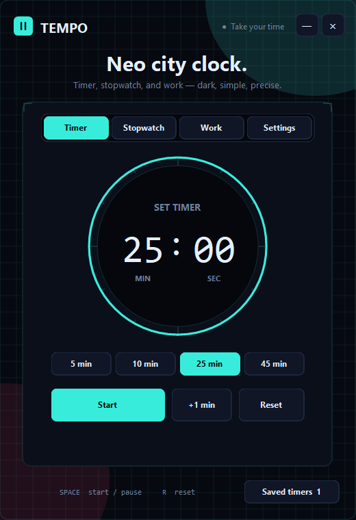
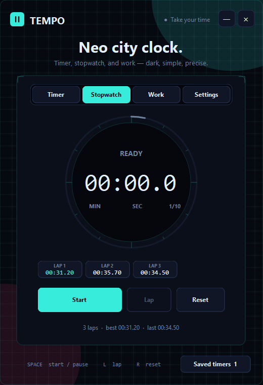
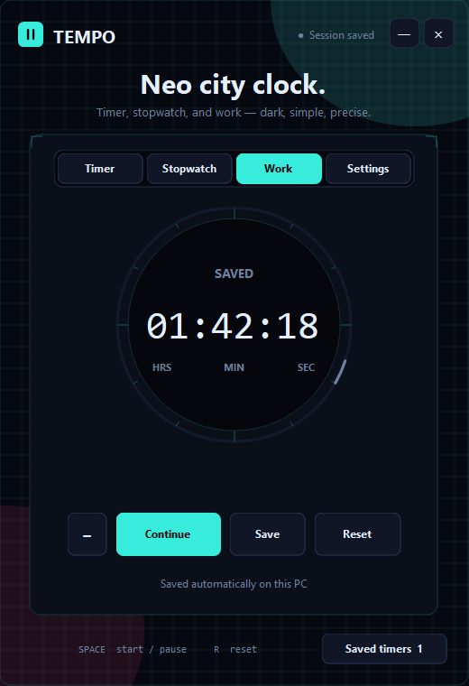
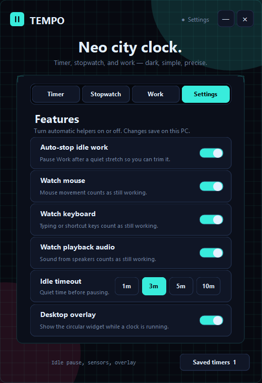
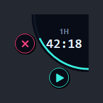

# Tempo

A small native **Windows** timer, stopwatch, and work-hours tracker. Built as a single-file WinForms app on .NET Framework 4.x — no installer, no accounts, no cloud.

This repo is a public example of desktop UI work: custom drawing, an always-on-top overlay, and local-only persistence.

## Preview

  

  
  &nbsp;
  

  
  &nbsp;
  

## What it does

- **Timer** — presets or typed minutes/seconds, circular progress ring
- **Stopwatch** — running time with laps
- **Work** — session total that saves on this PC; named snapshots in **Saved timers**
- **Overlay** — a circular always-on-top widget while something is running (snaps to screen corners)
- **Settings** — turn idle auto-stop, mouse / keyboard / audio sensors, and the overlay on or off
- **Idle pause** — work mode can pause after a quiet stretch (mouse, keyboard, or playback audio)
- **Trim** — knock minutes off a work session if you forgot to pause

Work history stays in `%LocalAppData%\Tempo` on your machine. This repository does not contain timers, session names, or other personal data.

## Run

Download or clone the repo and open `Tempo.exe` on Windows.

Needs a current Windows install (includes .NET Framework 4.x).

## Controls

| Key | Action |
| --- | --- |
| Space | Start / pause |
| R | Reset (Work: new work) |
| L | Lap (stopwatch) |

Drag the overlay to move it. Hover it for pause and end.

## Source

Everything lives in [`Tempo.cs`](Tempo.cs) — palette, overlay, work saves, and idle detection in one file on purpose, so the app stays easy to read and compile.
